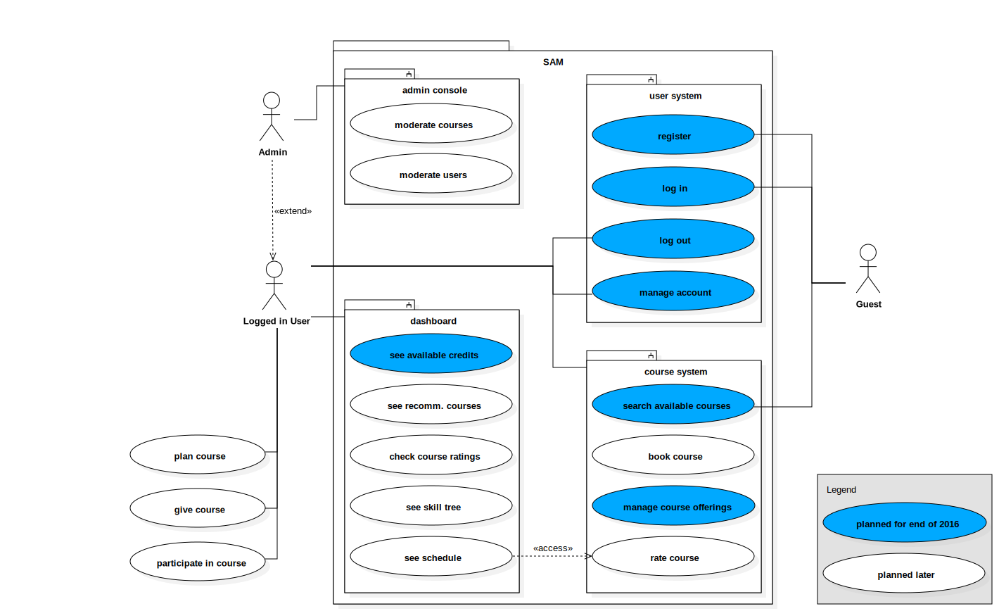

***
### 
SAM Initiative

***
 
 
 
<h2 align="right"> Skill Access Manager 
Software Requirements Specification 
For Skill Access Manager Application </h2>

####
Version 1.0

 
 
 

## Table of Contents

1. [Introduction](https://github.com/Eynorey/SAM/blob/master/SAM-Documentation/SRS.md#1---introduction)
  1. [Purpose](https://github.com/Eynorey/SAM/blob/master/SAM-Documentation/SRS.md#11-purpose)
  2. [Scope](https://github.com/Eynorey/SAM/blob/master/SAM-Documentation/SRS.md#12-scope)
  3. [Definitions, Acronyms, and Abbreviations](https://github.com/Eynorey/SAM/blob/master/SAM-Documentation/SRS.md#13-definitions-acronyms-and-abbreviations)
  4. [References](https://github.com/Eynorey/SAM/blob/master/SAM-Documentation/SRS.md#14-references)
  5. [Overview](https://github.com/Eynorey/SAM/blob/master/SAM-Documentation/SRS.md#15-overview)
2. [Overall Description](https://github.com/Eynorey/SAM/blob/master/SAM-Documentation/SRS.md#2---overall-description)
  1. [Vision](https://github.com/Eynorey/SAM/blob/master/SAM-Documentation/SRS.md#21-vision)
  2. [Use Case Diagram](https://github.com/Eynorey/SAM/blob/master/SAM-Documentation/SRS.md#22-use-case-diagram)
3. [Specific Requirements](https://github.com/Eynorey/SAM/blob/master/SAM-Documentation/SRS.md#3---specific-requirements)
  1. [Functionality](https://github.com/Eynorey/SAM/blob/master/SAM-Documentation/SRS.md#31-functionality)
  2. [Usability](https://github.com/Eynorey/SAM/blob/master/SAM-Documentation/SRS.md#32-usability)
  3. [Reliability](https://github.com/Eynorey/SAM/blob/master/SAM-Documentation/SRS.md#33-reliability)
  4. [Performance](https://github.com/Eynorey/SAM/blob/master/SAM-Documentation/SRS.md#34-performance)
  5. [Supportability](https://github.com/Eynorey/SAM/blob/master/SAM-Documentation/SRS.md#35-supportability)
  6. [Design constraints](https://github.com/Eynorey/SAM/blob/master/SAM-Documentation/SRS.md#36-design-constraints)
  7. [On-line User Documentation and Help System Requirements](https://github.com/Eynorey/SAM/blob/master/SAM-Documentation/SRS.md#37-on-line-user-documentation-and-help-system-requirements)
  8. [Purchased Components](https://github.com/Eynorey/SAM/blob/master/SAM-Documentation/SRS.md#38-purchased-components)
  9. [Interfaces](https://github.com/Eynorey/SAM/blob/master/SAM-Documentation/SRS.md#39-interfaces)
  10. [Licensing Requirements](https://github.com/Eynorey/SAM/blob/master/SAM-Documentation/SRS.md#310----licensing-requirements)
  11. [Legal, Copyright, and Other Notices](https://github.com/Eynorey/SAM/blob/master/SAM-Documentation/SRS.md#311----legal-copyright-and-other-notices)
  12. [Applicable Standards](https://github.com/Eynorey/SAM/blob/master/SAM-Documentation/SRS.md#312----applicable-standards)
4. [Supporting Information](https://github.com/Eynorey/SAM/blob/master/SAM-Documentation/SRS.md#4---supporting-information) 
  
 
 
###
Software Requirements Specification

 

## 1.	Introduction
### 1.1	Purpose
This Software Requirements Specification was created to collect and organize the requirements for the Skill Access Management Application. It includes a thorough description of the expected functionality for the project concerned, as well as the nonfunctional requirements. These are crucial for the purposes of establishing the understanding between the suppliers of the software and the customers, as well as minimizing the risks connected to the misinterpreting customer’s expectations. The document will furthermore provide the basis for costs-estimation and later validation of the results achieved.  
### 1.2	Scope
The requirements specified in the document are to be applied to the SAM Project. The Skill Access Manager is a free-to-use social platform, which provides a common space for people who want to share their knowledge and profit from other people’s expertise.

ACTORS: There are three types of actors: __guests__, __users__ and __admins__.

* Guests – visitors, who either do not have a personal account or are not logged into their profile
* Users – registered SAM-users
* Admins – (extends users) initially SAM-developers, later on a support team with enhanced abilities on the website.

SUBSYSTEMS: There are four subsystems to the platform: __user system__, __course system__, __dashboard__ and __admin console__. 

* User system – allows the actors to be identified as users/guests/admins,  store personal information relevant to the platform. 
* Course system – allows users to create new, search or book available and rate their attended courses.
* Dashboard – gives users an overview of their progress as tutors (depending on given courses) or students (depending on attended courses), scheduled and recommended classes and account balance. 
* Admin console – a system only available for the admins. Allows privileged users to moderate courses and users in accordance with the platform policies.  

### 1.3	Definitions, Acronyms, and Abbreviations
Definitions, Acronyms and Abbreviations relevant for the interpretation of the present document can be found in the [Project Glossary](https://github.com/Eynorey/SAM/wiki/Project-Glossary "SAM Project Glossary"). 

### 1.4	References
|Title |	Date	| Publishing organization |
|------|----------------|-------------------------|
|[Project Glossary](https://github.com/Eynorey/SAM/wiki/Project-Glossary "SAM Project Glossary") |	23/10/16 | SAM Initiative |
|-|-|-|

### 1.5	Overview

The following document will provide all the requirement information connected to the SAM-Project. It will introduce the overall description of the project, based on the vision and a use case diagram. In order to achieve a high level of specification in defining the requirements, all the functions presented in the diagram are going to be examined separately (see chapter 3.1). Further requirements are going to be divided into the following five categories: 

* Usability
* Reliability
* Performance
* Supportability
* Design constraints 

All the externally obtained components, relevant interfaces and licensing requirements as well as legal disclaimers and standards (if applicable) are going to be listed in chapters 3.8 through 3.12. Chapter 4 will provide the reader with the supporting information for the present document.

## 2.	Overall Description

### 2.1	Vision

Long before the digital era, the world has come to realize that knowledge is the key to any type of development. However, by the end of the 20th century the essence of knowledge itself has been changed dramatically. The new level of information accessibility made it into common property rather than a privilege. The fact, that a kid with a smartphone is no worse than a walking encyclopedia, caused a focus shift from information to skill.

Today, Internet can offer a broad variety of information, but fails to teach you how to apply it. Acquiring practical skills is therefore still associated with a new expense item in the budget and having to leave the comfort of your own home. Our platform is designed to change that.

Skill Access Manager, or SAM, will become a network connecting you to those who are ready to share practical knowledge in hundreds of different spheres and those, who want to learn exactly what you have to offer. Earn points by helping your peers out with whatever you like doing most, whether it is playing piano, skating, or solving mathematical equations. Get rated by your students and invest the points earned to learn from others. It is really as simple as that.

We at SAM believe that everyone has some skills to offer. Something you do as a hobby, or without even thinking about it twice, is what others are dying to learn. Use that to become the better version of yourself. Acquire new skills and share them with others. Smartify yourself. Today. With SAM.

### 2.2	Use Case Diagram

## 3.	Specific Requirements 

### 3.1	Functionality

The overall use case diagram, which gives an overview for the project as a whole, devides SAM-System into four different blocks or subsystems: 
* User system
* Course system
* Dashboard
* Admin console

These are going to represent the organizational structure of the present chapter. Each use case covered in the diagram is going to be described in a separate section of a corresponding block with a functional requirements connected to the use case in question. 

#### 3.1.1	User System

##### 3.1.1.1	Register
Any unregistered user (guest) is able to create an account (register) on the SAM-Page by providing the following information: 

- name
- e-mail
- password

Before the registration can come into force, the user is asked to agree to the Terms and Conditions provided by the SAM Initiative and confirm his e-mail address by following a link. After the e-mail has been confirmed a guest can log into his profile. 
##### 3.1.1.2 Log In
Any registered guest can perform a log in operation. Inserting correct registration data in the corresponding fields opens access to a user profile on the SAM platform.  
##### 3.1.1.3 Log out
Logged in users can change their role to "guest" by clicking on the "Log out" button.
##### 3.1.1.4 Manage Account
Any logged in user can add, edit or delete personal information in his profile. 

#### 3.1.2	Course System

##### 3.1.2.1	Search Available Courses
Any platform visitor (guest/admin/user) is able to see and navigate the list of courses offered by SAM-users. These can be searched and sorted by any relevant criteria (such as subject, name or tutor). General information about each course can be obtained from the list, whereas detailed course discription is shown after a click on the chosen course. 
##### 3.1.2.2 Book Course
Any user can book a course, as long as his credit points cover the costs of the course and the course is taking place any time after the booking operation has been performed. 
##### 3.1.2.3 Offer Course
Any user can offer a course by giving detailed information about it and defining point in time, when the course will take place. 
##### 3.1.2.4 Rate Course
Users, who partisipated in a SAM-course, can rate it by filling in a short questionnaire about their experience. 

#### 3.1.3	Dashboard

##### 3.1.3.1	See Available Credits
Credit Points or credits are users financial resources. Registering on the platform (see chapter 3.1.1.1) provides the new user with a start capital which can be spent on available courses (see chapter 3.1.2.2). Further credits can be earned by giving courses. The dashboard interface provides the user with information about his Credit Points account.   
##### 3.1.3.2 See Recommended Courses
Depending on the information provided in the profile (see chapter 3.1.1.4), SAM can put together a personalized list of courses, which might be interesting for the user. These are accessible from the dashboard interface. 
##### 3.1.3.3 Check Course Ratings
Dashboard provides logged in users with the rating of the courses they have given in the past, based on the reviews of those who attended these courses (see chapter 3.1.2.4). 
##### 3.1.3.4 See Skill Tree
Any user can track his or her progress in form of a skill tree, which is developed by SAM to visualize the knowledge obtained while using the platform. 
##### 3.1.3.5 See Schedule
All the booked and offered courses, which take place at any point in the future can be seen in the schedule. Schedule is a part of the dashbord interface and helps users to plan their time by reminding them about the upcoming events.  

#### 3.1.4	Admin console

##### 3.1.4.1 Moderate Courses
A user with admin privileges can disapprove of any course offered on the platform based on the guidelines provided by the SAM Initiative. The denounced course has to be removed from the platform or edited to comply with the guidelines. 
##### 3.1.4.2 Moderate Users
An admin has the power to punish a user for violation of Terms and Conditions provided by the SAM Initiative. 

### 3.2	Usability 
[This section includes all those requirements that affect usability. For example,
•	specify the required training time for a normal users and a power user to become productive at particular operations
•	specify measurable task times for typical tasks or base the new system’s usability requirements on other systems that the users know and like
•	specify requirement to conform to common usability standards, such as IBM’s CUA standards Microsoft’s GUI standards]
#### 3.2.1	<Usability Requirement One>
[The requirement description goes here.]
### 3.3	Reliability 
[Requirements for reliability of the system should be specified here. Some suggestions follow:
•	Availability—specify the percentage of time available ( xx.xx%), hours of use, maintenance access, degraded mode operations, and so on.
•	Mean Time Between Failures (MTBF) — this is usually specified in hours, but it could also be specified in terms of days, months or years.
•	Mean Time To Repair (MTTR)—how long is the system allowed to be out of operation after it has failed?
•	Accuracy—specifies precision (resolution) and accuracy (by some known standard) that is required in the system’s output.
•	Maximum Bugs or Defect Rate—usually expressed in terms of bugs per thousand lines of code (bugs/KLOC) or bugs per function-point( bugs/function-point).
•	Bugs or Defect Rate—categorized in terms of minor, significant, and critical bugs: the requirement(s) must define what is meant by a “critical” bug; for example, complete loss of data or a complete inability to use certain parts of the system’s functionality.]
#### 3.3.1	<Reliability Requirement One>
[The requirement description.]
### 3.4	Performance
[The system’s performance characteristics are outlined in this section. Include specific response times. Where applicable, reference related Use Cases by name.
•	Response time for a transaction (average, maximum)
•	Throughput, for example, transactions per second
•	Capacity, for example, the number of customers or transactions the system can accommodate
•	Degradation modes (what is the acceptable mode of operation when the system has been degraded in some manner)
•	Resource utilization, such as memory, disk, communications, and so forth.
#### 3.4.1	<Performance Requirement One>
[The requirement description goes here.]
### 3.5	Supportability
[This section indicates any requirements that will enhance the supportability or maintainability of the system being built, including coding standards, naming conventions, class libraries, maintenance access, and maintenance utilities.]
#### 3.5.1	<Supportability Requirement One>
[The requirement description goes here.]
### 3.6	Design Constraints
[This section indicates any design constraints on the system being built. Design constraints represent design decisions that have been mandated and must be adhered to.  Examples include software languages, software process requirements, prescribed use of developmental tools, architectural and design constraints, purchased components, class libraries, and so on.]
#### 3.6.1	<Design Constraint One>
[The requirement description goes here.]
### 3.7	On-line User Documentation and Help System Requirements
[Describes the requirements, if any, for o-line user documentation, help systems, help about notices, and so forth.]
### 3.8	Purchased Components

As for now, we will be using the free options provided by Microsoft Azure and other completely free tools. If we find ourselves needing more, we will switch to a paid option and update this section accordingly.	

### 3.9	Interfaces

tbd

#### 3.9.1	User Interfaces

There will be the following user interfaces implemented which will soloely be accessible through the web:		
 * **Landing page** showing available courses to guests of the site		
 * **Login screen** enabling users to register or log in		
 * **Dashboard**		
   * display recommended courses		
   * book courses		
   * offer courses		
   * show profile info		
 * **Settings** to edit profile or account information		
 * **Admin Console** to moderate courses and user profiles

#### 3.9.2	Hardware Interfaces

n/a

#### 3.9.3	Software Interfaces

tbd

#### 3.9.4	Communications Interfaces

The service will be hosted on and will be accessible only through the internet, thus an internet conneciton is required.

### 3.10	Licensing Requirements

Under public GitHub license.

### 3.11	Legal, Copyright, and Other Notices

tbd

### 3.12	Applicable Standards

tbd

## 4.	Supporting Information

tbd
